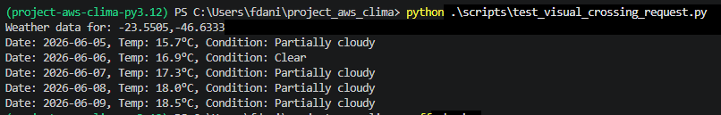
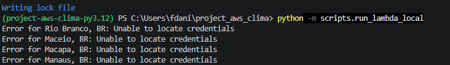
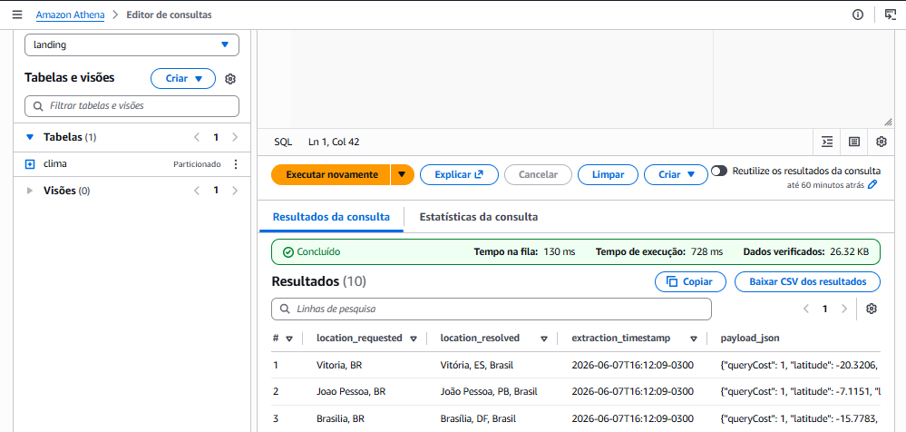
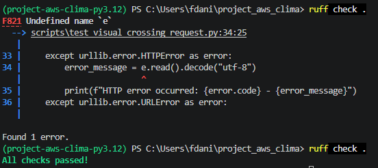

---
# 🌦️ Project AWS Clima

Projeto de engenharia de dados para coleta, ingestão e armazenamento de dados climáticos utilizando **Python**, **Visual Crossing Weather API**, **AWS Lambda** e **Amazon S3**.

Este projeto está sendo desenvolvido com foco em boas práticas de engenharia de dados, versionamento, organização de ambiente, segurança de credenciais e preparação para construção de um pipeline completo em nuvem.

---

## 🎯 Objetivo do Projeto

O objetivo principal é construir um pipeline de dados climáticos capaz de:

- consumir dados de uma API meteorológica;
- validar a requisição localmente;
- executar a ingestão em uma função AWS Lambda;
- armazenar os dados brutos no Amazon S3;
- organizar os arquivos com particionamento;
- preparar a base para consultas futuras com AWS Glue, Athena ou Spark.

A primeira etapa do projeto foca na camada **raw/bronze**, onde os dados são armazenados próximos ao formato original retornado pela API.

---

## 🌍 Sobre APIs Climáticas

Durante a análise inicial foram consideradas duas APIs:

### OpenWeather

A OpenWeather, disponível em `openweathermap.org`, é uma API bastante conhecida para dados meteorológicos. Ela oferece endpoints para clima atual, previsão, geocoding, qualidade do ar e outros produtos climáticos.

Ela é uma boa opção para aplicações que precisam consultar clima em tempo real ou construir dashboards simples.

### Visual Crossing

A Visual Crossing Weather API foi escolhida para este projeto por ser mais adequada ao contexto de engenharia de dados.

Ela permite consultar dados climáticos usando uma estrutura simples e flexível, com suporte a:

- dados atuais;
- previsão do tempo;
- histórico climático;
- consulta por localização;
- consulta por latitude e longitude;
- retorno em JSON;
- uso em pipelines de dados.

Neste projeto, a localização inicial utilizada foi São Paulo via latitude e longitude:

```-23.5505,-46.6333```

## 🌍 Sobre as Fontes de Dados Climáticos

Durante a etapa inicial do projeto foram analisadas duas APIs climáticas diferentes: **OpenWeather** e **Visual Crossing**.

É importante destacar que elas são serviços independentes. A Visual Crossing não pertence à OpenWeather e não é uma extensão da OpenWeather. Cada uma possui sua própria plataforma, documentação, chave de API, endpoints, limites de uso e estrutura de resposta.

### Por que a Visual Crossing foi escolhida?

A Visual Crossing foi escolhida neste projeto porque oferece uma estrutura simples para ingestão de dados em pipelines.

Para engenharia de dados, isso é útil porque facilita:

- extração de dados por período;
- armazenamento do payload bruto;
- criação de partições por data e localização;
- integração com S3;
- evolução futura para Glue, Athena e camadas tratadas.

### 🛠️ Tecnologias Utilizadas:

- Python 3.12
- Poetry para gerenciamento de dependências
- python-dotenv para leitura de variáveis locais
- boto3 para integração com serviços AWS
- ruff para qualidade e padronização do código
- AWS Lambda
- Amazon S3
- Visual Crossing Weather API
- Git e GitHub


### 📁 Estrutura do Projeto:
```
project_aws_clima/
├── docs/
│   ├── images/
│   └── troubleshooting.md
├── scripts/
|       └── reports/
|              └── aws_report.json
|              └── validacao_lambda.json
│   ├── run_lambda_local.py
│   └── aws_report.py
|   └── validation_ingestion_lambda.py
|    
|    
├── lambda_function.py
├── README.md
├── LICENSE
├── pyproject.toml
├── poetry.lock
└── .env.example
```

## Descrição dos arquivos:

| Arquivo |	 Função | 
|--|--| 
scripts/test_visual_crossing_request.py	|Script local para validar a conexão com a API
lambda_function.py | 	Arquivo reservado para a função AWS Lambda
scripts/ | Scripts de teste e validação local da API e integração
docs/images/ | Screenshots de validação no AWS (Athena, S3, Lambda)
docs/troubleshooting.md | Documentação de problemas, erros e soluções do pipeline
.env.example |	Modelo das variáveis de ambiente necessárias
.gitignore | Define arquivos que não devem ser versionados
pyproject.toml |	Configuração do projeto Poetry
poetry.lock |	Controle exato das versões instaladas
README.md |	Documentação do projeto
LICENSE	| Licença do projeto

## 📦 Dependências Instaladas:

### Dependências principais

```poetry add boto3```

*O boto3 será utilizado para integração com a AWS, principalmente para gravar arquivos no Amazon S3.*

### Dependências de desenvolvimento:

```poetry add --group dev pytest python-dotenv ruff```

*Essas dependências foram adicionadas para apoiar desenvolvimento, testes e qualidade do código.*

 `tzdata`: suporte a timezones IANA no Windows, como `America/Sao_Paulo`.

## 🔐 Variáveis de Ambiente:

O projeto utiliza um arquivo .env local, que não deve ser versionado. O arquivo .env.example serve como modelo seguro.

## 🧪 Teste Local da API:

Antes de construir a Lambda, foi criado um script local para validar a conexão com a Visual Crossing:

```scripts/test_visual_crossing_request.py```

Esse teste confirma que:

o ambiente virtual está funcionando;
o .env está sendo carregado;
a chave da Visual Crossing é válida;
a API está respondendo corretamente.

### Teste da Lambda em Ambiente Local:

Foi criado o script:

```scripts/run_lambda_local.py```

### Esse script executa localmente a função:

```lambda_function.lambda_handler({}, None)```

O teste local conseguiu executar a lógica da Lambda, mas retornou erro ao tentar gravar no S3:

- Unable to locate credentials

## Teste Local da Visual Crossing API:



A imagem de ```tests_.png``` mostra o teste local de requisição e extração dos dados da Visual Crossing API pelo terminal.

Ela evidencia que o script conseguiu carregar a chave da API pelo .env, montar a URL da Visual Crossing, fazer a requisição HTTP, receber a resposta em JSON, extrair campos do retorno e 
imprimir no terminal dados como data, temperatura e condição climática.

```
Esse teste confirma que a etapa inicial do pipeline está funcionando: a aplicação consegue se conectar à fonte de dados, consumir a API e extrair informações climáticas do retorno.
```

### Teste Local da Lambda sem Credenciais AWS



*Esse comportamento é esperado, porque localmente o boto3 precisa de credenciais AWS configuradas na máquina.*

### Conclusão:

- a função Lambda foi importada corretamente;
- o lambda_handler existe e pode ser executado;
- o carregamento de variáveis locais funcionou;
- a API foi chamada;
- a falha ocorreu somente na autenticação local com a AWS.

*Em ambiente AWS Lambda, a autenticação com o S3 é feita por IAM Role, não por credenciais locais.*

### Teste da Lambda em Nuvem:

> A função Lambda foi testada no ambiente AWS e executou com sucesso.

Resultado obtido:

```python
{
  "statusCode": 200,
  "message": "Weather ingestion finished",
  "partition_date": "2026-06-04",
  "success_count": 27,
  "failure_count": 0
}
```

*A Lambda coletou dados climáticos para 27 capitais brasileiras e salvou os arquivos JSON no Amazon S3.*

## 🚀✨ Refatoração da camada Raw para evitar conflitos de schema no Glue e Athena:

*Durante a modelagem da camada Raw, optou-se por armazenar o payload completo da API como string JSON (payload_json) para evitar conflitos de schema gerados pela inferência automática do AWS Glue em estruturas JSON dinâmicas.*

*A validação da integração com Amazon S3 foi realizada diretamente através da execução da função AWS Lambda no ambiente da AWS, utilizando uma IAM Role com permissões específicas para gravação no bucket de destino.*

👉 Detalhes dos desafios técnicos encontrados durante o desenvolvimento estão documentados em:
[Troubleshooting do projeto](docs/troubleshooting.md)

### 🧩📊 Integração com Glue e Athena

- Crawler criado com sucesso.
- Catálogo gerado.
- Partições reconhecidas.
- Consultas funcionando no Athena.
- Payload armazenado como string JSON.

---

📊 “Validação inicial da camada Raw no Athena após refatoração de schema (Glue Catalog integrado)”



---


### Separação de Responsabilidades:

O projeto separa scripts locais da função de nuvem:

```
scripts/test_visual_crossing_request.py  -> teste local da API
scripts/run_lambda_local.py              -> execução local da Lambda
lambda_function.py                       -> função AWS Lambda
```

> Essa separação evita misturar código de teste com código de produção.

## 🧹 Qualidade de Código:

O projeto utiliza ruff para validação de estilo e identificação de problemas no código.

Durante o desenvolvimento, o ruff identificou um erro real de variável indefinida, o que reforça a importância de usar ferramentas de qualidade desde o início.

### Validação de Qualidade com Ruff:



O **Ruff** é uma ferramenta de análise estática para código Python. Ele faz uma varredura nos arquivos do projeto e identifica problemas como erros de sintaxe, variáveis não definidas, imports não utilizados, más práticas e inconsistências de estilo.

Depois da correção, o comando foi executado novamente:

```
ruff check .
```

### E o resultado foi:

```
All checks passed!
```

> Isso indica que a varredura foi concluída sem encontrar novos problemas.

Essa etapa é importante porque ajuda a encontrar erros antes da execução do código em ambiente de nuvem, evitando falhas simples durante o deploy ou execução da AWS Lambda.

Neste projeto, o Ruff foi utilizado para validar o código antes de avançar para a execução da Lambda e para o versionamento no GitHub.

> O ponto (.) indica que o Ruff deve analisar todos os arquivos do projeto a partir da pasta atual.

O erro acima significa que o código tentou usar uma variável chamada **e**, mas essa variável não existia naquele contexto. Sendo corrigida após a identificação do erro pelo **ruff**
---

# 🚀 Feature: Auditoria AWS e Validação da Ingestão

Esta etapa do projeto teve como objetivo aumentar a confiabilidade da plataforma através da validação da infraestrutura AWS, da conectividade com os serviços utilizados e da verificação automática da ingestão realizada pela AWS Lambda.

---

## 🎯 Objetivos da Feature

* Validar credenciais AWS configuradas localmente.
* Confirmar acesso ao Amazon S3.
* Auditar informações básicas da conta e dos buckets.
* Validar a execução da ingestão realizada pela AWS Lambda.
* Verificar a criação das partições da camada Raw.
* Gerar evidências em formato JSON para auditoria e troubleshooting.
* Facilitar a manutenção e evolução da plataforma.

---

# ☁️ Auditoria AWS

Script responsável por validar a conectividade com a conta AWS e coletar informações do ambiente.

## Arquivo

```text
scripts/aws_report.py
```

## Funcionalidades:

1. Validação de autenticação AWS
2. Verificação de acesso ao Amazon S3
3. Coleta de metadados da resposta AWS
4. Identificação da região configurada
5. Contagem de buckets disponíveis
6. Exibição formatada utilizando Rich
7. Exportação de relatório JSON

---

## Exemplo de informações coletadas:

```json
{
    "request_id": "SNC29A1G7M39WMEG",
    "status_code": 200,
    "region": "us-east-2",
    "bucket_count": 1,
    "first_bucket": "amazon-s3-clima-project-442767638718-us-east-2-an"
}
```

---

## Relatório gerado

```text
reports/aws_report.json
```

---

# 🌦️ Validação da Ingestão da Lambda

Script responsável por validar se a AWS Lambda realizou corretamente a ingestão dos dados climáticos no Amazon S3.

## Arquivo

```text
scripts/validation_ingestion_lambda.py
```

## Funcionalidades:

1. Leitura automática do bucket configurado
2. Navegação por todos os objetos utilizando paginação AWS
3. Contagem total de arquivos ingeridos
4. Identificação automática das partições
5. Validação da estrutura utilizada pelo Glue e Athena
6. Geração de evidências para auditoria
7. Exportação de relatório JSON

---

## Estrutura validada

A validação verifica se os arquivos foram gravados seguindo o padrão:

```text
raw/
└── clima/
    └── source=visual_crossing/
        └── date=YYYY-MM-DD/
            └── location=<cidade>/
                └── weather_*.json
```

Exemplo:

```text
raw/clima/source=visual_crossing/date=2026-06-09/location=sao_paulo_br/weather_20260609010101.json
```

---

## Exemplo de relatório gerado

```json
{
    "bucket": "amazon-s3-clima-project-442767638718-us-east-2-an",
    "prefix": "raw/clima",
    "total_arquivos": 27,
    "total_particoes": 27,
    "particoes": {
        "date=2026-06-09/location=sao_paulo_br": 1,
        "date=2026-06-09/location=goiania_br": 1,
        "date=2026-06-09/location=rio_de_janeiro_br": 1
    }
}
```

---

## Relatório gerado

```text
reports/validation_ingestion_lambda.json
```

---

# 📊 Evidências Geradas

Todos os relatórios produzidos durante a execução são armazenados automaticamente na pasta:

```text
reports/
├── aws_report.json
└── validation_ingestion_lambda.json
```

Esses arquivos servem como:

* Evidência de execução
* Auditoria técnica
* Troubleshooting
* Validação da infraestrutura
* Apoio para futuras evoluções do projeto

---

# 🏗️ Benefícios Obtidos

### Confiabilidade

A infraestrutura pode ser validada rapidamente antes de novas implantações.

### Observabilidade

As informações críticas da AWS ficam registradas em arquivos de auditoria.

### Rastreabilidade

As execuções passam a possuir evidências persistidas.

### Governança

Permite validar se os dados estão sendo armazenados corretamente antes da catalogação pelo AWS Glue.

### Qualidade de Dados

Confirma que a estrutura de particionamento esperada foi criada corretamente.

---

### 🧠 Boas Práticas Aplicadas:

### Engenharia de Dados:

- Separação entre camada raw e futuras camadas tratadas.
- Armazenamento do payload refatorado da API.
- Uso de particionamento no S3.
- Inclusão de metadados de extração com Glue AWS
- Estrutura compatível com consultas no Athena.

### Desenvolvimento:

- Ambiente isolado com Poetry.
- Dependências controladas por poetry.lock.
- Uso de .env para segredos locais.
- Uso de .env.example como documentação.
- Código validado com ruff.
- Separação entre script local e função Lambda.
- Versionamento com Git.

### Segurança:

- Chaves de API não são versionadas.
- Credenciais AWS não serão salvas no código.
- Lambda usará IAM Role para acessar o S3.
- Permissões IAM devem seguir o princípio do menor privilégio.


## 📌 Status Atual

O projeto atualmente possui:

- Ambiente Poetry configurado;
- Lambda operacional em ambiente AWS;
- Integração com Visual Crossing API;
- Ingestão de 27 capitais brasileiras;
- Armazenamento em Amazon S3;
- Particionamento por data e localização;
- AWS Glue Crawler configurado;
- Catálogo de dados criado;
- Consultas funcionando no Amazon Athena;
- Payload serializado para evitar conflitos de schema;
- Estrutura preparada para evolução para camadas Trusted e Refined.

## 🚀 Quer executar o projeto e continuar?

### 📌 1. Pré-requisitos 

- Python 3.12+
- Poetry instalado
- Conta AWS ativa
- AWS CLI configurado (`aws configure`)
- Permissões para:
  - AWS Lambda
  - Amazon S3
  
  

### 📌 2. Clonar o repositório

```
git clone https://github.com/seu-usuario/project_aws_clima.git
cd project_aws_clima
```

### 📌 3. Instalar dependências com ou sem o poetry

```
poetry install
```

### 📌 4. Configurar variáveis de ambiente

Crie um arquivo `.env` baseado no `.env.example`:

```
Exemplo:

AWS_REGION=us-east-1
S3_BUCKET_NAME=meu-bucket-clima
VISUAL_CROSSING_API_KEY=sua_chave_aqui
```

### 📌 5. Execução local (teste da API)

```
python scripts/test_visual_crossing_request.py
```
*A request e KEY são criadas pela IA da Visual Crossing no site oficial*

## 📌 6. Deploy da Lambda 

O deploy da função Lambda pode ser realizado de duas formas, dependendo das permissões disponíveis na conta AWS:

---
### 🔹 1. Deploy via AWS Console 

Este é o método mais simples e não requer configuração local de IAM CLI.

1. Acesse o serviço AWS Lambda no console
2. Crie uma nova função (ou edite uma existente)
3. Escolha runtime Python 3.12
4. Configurar handler:
   ``` lambda_function.lambda_handler```
5. Definir variáveis de ambiente na Lambda

---

### 🔹 2. Deploy via AWS CLI 

Este método requer permissões IAM adequadas configuradas localmente. E depois execute o comando.

```
python scripts/run_lambda_local.py
```
ou ``` python lambda_function.py ```

## 📌 7. Configuração do S3 + Glue + Athena

1. Criar bucket S3 para camada Raw
2. Configurar serviço AWS Lambda ( tests e deploy )
3. Configurar AWS Glue Crawler para catalogação dos metadados.
4. Consultar os dados no AWS Athena.

## 📌 8. Para validar as execuções é bom executar os comandos:

```python scripts/aws_report.py```
---
``` python scripts/validation_ingestion_lambda```

## 👤 Autor:

``` Daniel Martins França ```


## 📬 Contato:

- 📧 Email: [f.daniel.m@gmail.com](mailto:f.daniel.m@gmail.com)  
- 💼 LinkedIn: [www.linkedin.com/in/danixdev](https://www.linkedin.com/in/danixdev)  