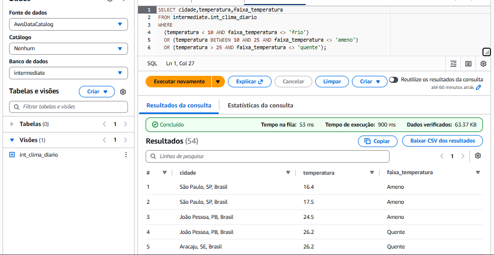
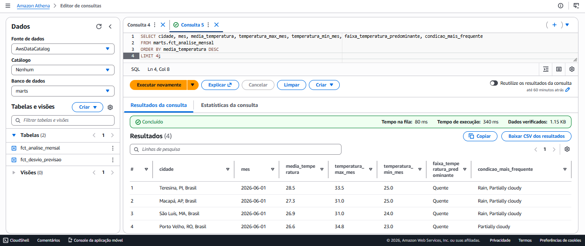
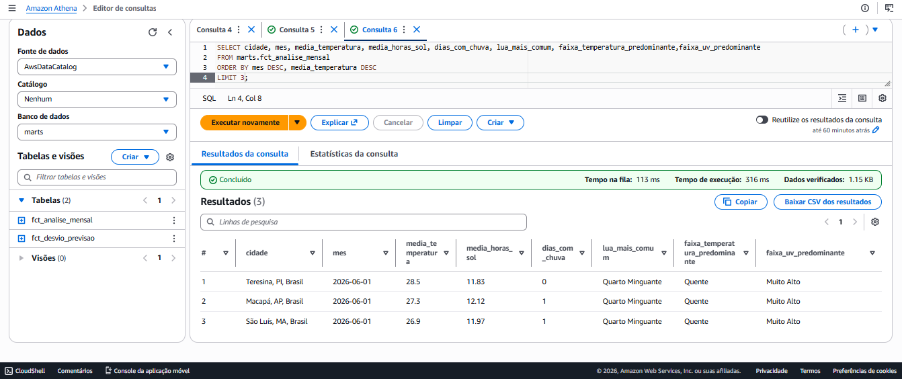
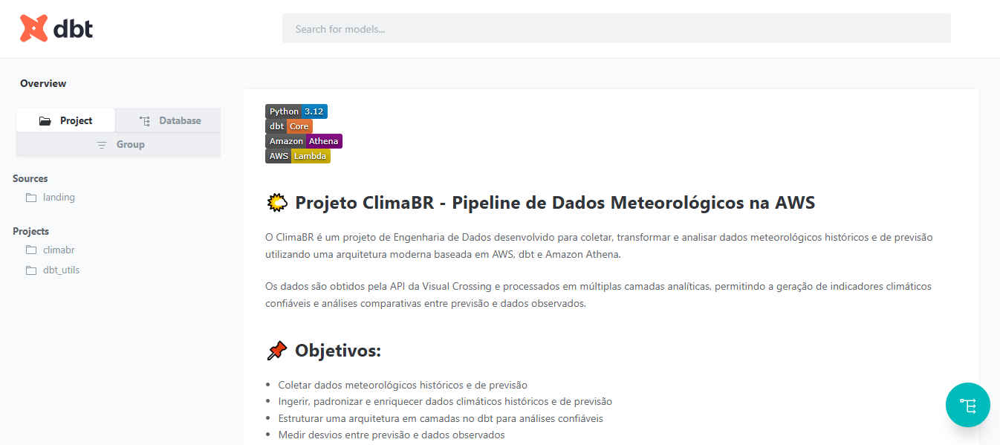
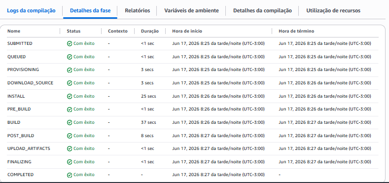

# 🌦️ climaBR - Pipeline de Transformação de Dados com dbt + AWS Athena

## 📌 Visão Geral

O climaBR é a camada de transformação do pipeline de dados climáticos da AWS.

Utiliza dbt sobre Amazon Athena para transformar dados brutos ingeridos via AWS Lambda em modelos analíticos confiáveis, estruturados e prontos para consumo.

O projeto utiliza práticas modernas de ELT com dbt sobre Amazon Athena, garantindo rastreabilidade, qualidade dos dados e automação completa do ciclo de deploy.

### 🏗️ Arquitetura do Pipeline:
```
Visual Crossing API
        ↓
AWS Lambda (Ingestão)
        ↓
Amazon S3 (Landing / Raw Data)
        ↓
AWS Glue Catalog
        ↓ 
Amazon Athena                       
        ↓
     dbt Core 
┌─────────────────┐ 
│    Staging      │ 
├─────────────────┤ 
│ Intermediate    │ 
├─────────────────┤ 
│     Marts       │ 
└─────────────────┘     
        ↓
    Analytics                
        ↓
     dbt docs
        ↓
Amazon S3 Website        
```
## 🚀 Pipeline CI/CD

O deploy é totalmente automatizado utilizando AWS CodeBuild.

Fluxo
GitHub
   │
   ▼
AWS CodeBuild
   │
   ├── poetry install
   ├── dbt build
   ├── dbt test
   ├── dbt docs generate
   │
   ▼
Amazon S3
   │
   ▼
dbt Docs Publicado

## Etapas do Pipeline:
### Install

- Instalação do Poetry
- Instalação do dbt
- Criação do ambiente virtual
- Pre-Build
- Criação dinâmica do profiles.yml
- Configuração do Athena
- Configuração dos buckets S3
- Build
- Execução do dbt build
- Execução dos testes
- Validação dos modelos
- Post-Build
- Geração do dbt Docs
- Publicação automática no S3
- Atualização do site de documentação

## 🧱 Camadas de Dados:
### 📥 Landing (Raw)

Dados brutos vindos da AWS Lambda, sem transformação e base histórica no S3.

### 🔄 Staging (staging):

- Limpeza e padronização
- Renomeação de colunas
- Conversão de tipos
- Deduplicação inicial

``` Exemplo: stg_clima```

### ⚙️ Intermediate (intermediate):

- Aplicação de regras de negócio
- Criação de colunas derivadas (CASE WHEN)
- Enriquecimento dos dados
- Base confiável para analytics

```Exemplo: int_clima_diario```

### 📊 Marts:

Camada analítica orientada ao consumo.

```fct_analise_mensal```

Tabela fato contendo agregações climáticas mensais por cidade.

```fct_desvio_previsao```

Tabela fato utilizada para análise de qualidade da previsão meteorológica.
- Camada final para BI
- KPIs e métricas agregadas
- Dataset pronto para dashboards

### 📊 Métricas Implementadas

- Temperatura
- Temperatura média diária
- Temperatura máxima
- Temperatura mínima
- Amplitude térmica
- Sensação Térmica
- Sensação térmica média
- Diferença entre sensação térmica e temperatura observada
- Umidade
- Umidade média
- Variação de umidade
- Precipitação
- Precipitação diária
- Precipitação acumulada
- Dias com chuva
- Radiação Solar
- Índice UV médio
- Horas de sol
- Vento
- Velocidade média
- Rajada máxima
- Cobertura Atmosférica
- Cobertura média de nuvens
- Visibilidade média
- Qualidade da Previsão
- Desvio entre previsto e realizado
- Erro Absoluto Médio (MAE)
- Erro Percentual
- Acurácia da previsão

### ⚙️ Tecnologias:

- Python 3.12
- Poetry
- dbt Core 1.11+
- dbt-athena-adapter
- AWS Lambda
- Amazon S3
- AWS Glue Catalog
- Amazon Athena
- AWS CodeBuild
- GitHub Actions / GitHub Releases

1. Instalar dependências
```poetry install``` ( Opcional )

2. Configurar profile dbt
```
climabr:
  outputs:
    dev:
      type: athena
      database: AwsDataCatalog
      schema: landing
      region_name: us-east-2
      s3_data_dir: s3://seu-bucket/tables/
      s3_staging_dir: s3://seu-bucket/metadata/
      threads: 1
```
3. Executar modelos

```dbt run```

Por camada:

```
dbt run --select staging
dbt run --select intermediate
dbt run --select mart
```

4. Executar testes

```dbt test```

## 🧪 Qualidade de Dados

O projeto garante qualidade com:

1. Testes automáticos

        - not_null
        - accepted_values

2. Regras de negócio


        - Consistência entre staging e intermediate

## 🔍 Exemplo de Transformação:

Classificação de temperatura:
```sql
CASE
  WHEN temperatura < 10 THEN 'frio'
  WHEN temperatura BETWEEN 10 AND 25 THEN 'ameno'
  ELSE 'quente'
END AS faixa_temperatura
```
### Validação de CASE WHEN:
```sql
SELECT cidade,temperatura,faixa_temperatura
FROM intermediate.int_clima_diario
WHERE
  (temperatura < 10 AND faixa_temperatura <> 'frio')
  OR (temperatura BETWEEN 10 AND 25 AND faixa_temperatura <> 'ameno')
  OR (temperatura > 25 AND faixa_temperatura <> 'quente');
```
### Validação da consulta no AWS Athena:



## 🚀 Objetivos:

- Construir pipeline confiável de dados climáticos
- Garantir consistência entre camadas
- Aplicar boas práticas de dbt e ELT moderno
- Criar base sólida para BI e análises

---
## Validação da consulta no AWS Athena para camada Marts:
### Ranking 3 de cidades com temperaturas mais quentes:



### Ranking 3 das cidades com temperaturas mais quentes e outras métricas:



### 📁 Estrutura:
```
climaBR/
│
├── models/
│   ├── staging/
│   ├── intermediate/
│   └── marts/
│
├── tests/
├── macros/
├── dbt_project.yml
└── README.md
```
### 📖 Documentação

A documentação completa do projeto é gerada através do dbt Docs.

poetry run dbt docs generate
poetry run dbt docs serve

### Deploy do dbt:



### 🏷️ Release:

```
Release Atual: v0.1.7 - Pipeline para ClimaBR via AWS CodeBuild
```

*Pipeline de dados desenvolvido com foco em engenharia de dados moderna na AWS utilizando dbt, Athena e boas práticas de modelagem ELT.*

### ⭐ Destaques do Projeto:

```0.1.7``` - Pipeline para ClimaBR via AWS CodeBuild

### Principais Entregas:

- Pipeline ELT completo
- Modelagem em camadas
- Testes automatizados
- Deploy automatizado via AWS CodeBuild
- Publicação automática do dbt Docs
- Versionamento por Releases

### 🎯 Objetivos do Projeto:

- Aplicar boas práticas de Engenharia de Dados
- Construir pipelines escaláveis
- Garantir qualidade dos dados
- Demonstrar arquitetura moderna AWS
- Disponibilizar dados confiáveis para BI

## Evidências:




### 👨‍💻 Autor

- Daniel Martins

**Engenharia de Dados | AWS | dbt | Athena**