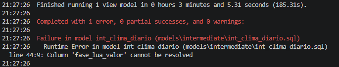
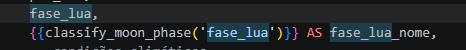
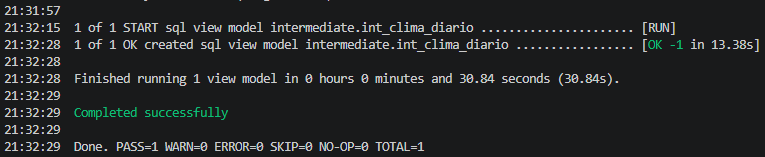

## Desafios Encontrados Durante o Desenvolvimento

Durante a construção do pipeline de ingestão de dados climáticos, diversos desafios técnicos foram identificados. A análise e resolução desses problemas contribuíram para o entendimento prático de conceitos importantes de Engenharia de Dados, Data Lakes e serviços da AWS.

### 1. Configuração de Credenciais AWS em Ambiente Local
## Desafios Encontrados Durante o Desenvolvimento

Durante a construção do pipeline de ingestão de dados climáticos, diversos desafios técnicos foram identificados. A análise e resolução desses problemas contribuíram para o entendimento prático de conceitos importantes de Engenharia de Dados, Data Lakes e serviços da AWS.

### 1. Configuração de Credenciais AWS em Ambiente Local

Ao executar a função Lambda localmente utilizando boto3, ocorreu o erro:

```text
Unable to locate credentials
```

O problema ocorreu porque o SDK da AWS necessita de credenciais válidas para acessar o Amazon S3 em ambiente local. Foi identificado que esse comportamento é esperado, já que em produção a autenticação da Lambda é realizada por meio de IAM Roles.

**Aprendizado:**

* Diferença entre autenticação local e autenticação em ambiente AWS.
* Uso de IAM Roles para acesso seguro aos serviços da AWS.

---

### 2. Configuração do Amazon Athena

Durante a primeira tentativa de execução de consultas no Athena, ocorreu o erro relacionado à ausência de local para armazenamento dos resultados das consultas.

**Solução:**

* Configuração de um bucket S3 para armazenamento dos resultados do Athena.

**Aprendizado:**

* Entendimento do funcionamento dos Workgroups e da persistência dos resultados de consultas no Athena.

---

### 3. Colunas Duplicadas no Glue Catalog

Após a execução do Glue Crawler, o Athena retornou o erro:

```text
HIVE_INVALID_METADATA:
Table descriptor contains duplicate columns
```

Foi identificado que os campos `source`, `date` e `location` estavam sendo reconhecidos simultaneamente como colunas do arquivo JSON e como colunas de particionamento do Data Lake.

**Aprendizado:**

* Diferença entre colunas de dados e colunas de partição.
* Importância do desenho correto da estrutura de diretórios no S3.

---

### 4. Problemas de Inferência Automática de Schema

O Glue Crawler inferiu automaticamente estruturas complexas presentes no JSON retornado pela Visual Crossing Weather API, especialmente no campo:

```json
payload.stations
```

Como cada cidade possui estações meteorológicas diferentes, cada partição passou a apresentar um schema distinto.

Isso resultou no erro:

```text
HIVE_PARTITION_SCHEMA_MISMATCH
```

**Aprendizado:**

* Limitações da inferência automática de schemas em estruturas JSON altamente dinâmicas.
* Importância da padronização de schemas para ambientes analíticos.

---

### 5. Estruturas Complexas para Consulta Analítica

O campo `payload` continha múltiplos níveis de objetos aninhados (`struct`) e arrays (`array<struct>`), dificultando consultas diretas no Athena.

**Aprendizado:**

* Diferença entre armazenamento operacional e armazenamento analítico.
* Necessidade de transformação dos dados para formatos mais adequados ao consumo analítico.

---

### Próximos Passos

Para simplificar a arquitetura e facilitar futuras consultas analíticas, serão avaliadas as seguintes melhorias:

* Armazenar o payload completo como texto JSON na camada Raw.
* Criar uma camada Silver contendo apenas atributos relevantes para análise.
* Converter dados para formatos colunares como Parquet.
* Utilizar AWS Glue para transformação e catalogação dos dados.
* Disponibilizar consultas analíticas através do Amazon Athena.

Esses desafios permitiram aprofundar conhecimentos em AWS Lambda, Amazon S3, AWS Glue, Amazon Athena, particionamento de dados, modelagem de Data Lakes e boas práticas de Engenharia de Dados.

---

### 3. Colunas Duplicadas no Glue Catalog

Após a execução do Glue Crawler, o Athena retornou o erro:

```text
HIVE_INVALID_METADATA:
Table descriptor contains duplicate columns
```

Foi identificado que os campos `source`, `date` e `location` estavam sendo reconhecidos simultaneamente como colunas do arquivo JSON e como colunas de particionamento do Data Lake.

**Aprendizado:**

* Diferença entre colunas de dados e colunas de partição.
* Importância do desenho correto da estrutura de diretórios no S3.

---

### 4. Problemas de Inferência Automática de Schema

O Glue Crawler inferiu automaticamente estruturas complexas presentes no JSON retornado pela Visual Crossing Weather API, especialmente no campo:

```json
payload.stations
```

Como cada cidade possui estações meteorológicas diferentes, cada partição passou a apresentar um schema distinto.

Isso resultou no erro:

```text
HIVE_PARTITION_SCHEMA_MISMATCH
```

**Aprendizado:**

* Limitações da inferência automática de schemas em estruturas JSON altamente dinâmicas.
* Importância da padronização de schemas para ambientes analíticos.

---

### 5. Estruturas Complexas para Consulta Analítica

O campo `payload` continha múltiplos níveis de objetos aninhados (`struct`) e arrays (`array<struct>`), dificultando consultas diretas no Athena.

**Aprendizado:**

* Diferença entre armazenamento operacional e armazenamento analítico.
* Necessidade de transformação dos dados para formatos mais adequados ao consumo analítico.

---

### 6. Erro de Resolução de Coluna no dbt (Camada Intermediate)

Durante a esteira de transformação de dados na camada Intermediate utilizando o dbt (Data Build Tool), a execução do modelo ```int_clima_diario``` falhou ao tentar referenciar uma coluna inexistente ou nomeada incorretamente.
O terminal retornou o seguinte erro de compilação/runtime:PlaintextFailure in model int_clima_diario (models\intermediate\int_clima_diario.sql)



### Causa do Problema:

O código SQL do modelo tentava selecionar ou operar sobre uma coluna chamada ```fase_lua_valor```, mas o schema vindo da camada anterior (Silver/Staging) continha apenas o campo ```fase_lua``` (provavelmente um valor numérico ou código bruto), quebrando a linhagem dos dados (data lineage).

### 7. Implementação de Macro Customizada para Tradução de Negócio

Para resolver o erro de coluna ausente e enriquecer o modelo com regras de negócio claras, foi mapeada a coluna correta (fase_lua) e aplicada uma macro customizada chamada ```classify_moon_phase.```

Essa macro automatiza a classificação dos valores numéricos da fase da lua diretamente em strings legíveis para a camada analítica:

```{{ classify_moon_phase('fase_lua') }} AS fase_lua_nome```

### Benefícios da Solução:

Eliminação do Erro: Substituiu-se a chamada da antiga coluna incorreta pelo campo mapeado da fonte.

### Reutilização de Código: 

Centralização da regra de negócio (tradução de códigos climáticos) em uma macro dbt reutilizável por outros modelos.

### Legibilidade:

Facilita o consumo final dos dados por ferramentas de BI, substituindo métricas brutas por rótulos compreensíveis (ex: "Cheia", "Nova")

## 8. Validação e Execução com Sucesso da Camada Intermediate: 

Após ajustar a referência do campo e aplicar a macro de classificação, o dbt foi executado novamente para validar o pipeline. O modelo ```int_clima_diario``` foi processado e materializado como uma SQL View com sucesso.




Log de Sucesso no Terminal:




### Aprendizado:

Importância de garantir a consistência de nomenclaturas entre camadas do Data Lake (Raw $\rightarrow$ Silver $\rightarrow$ Gold).
