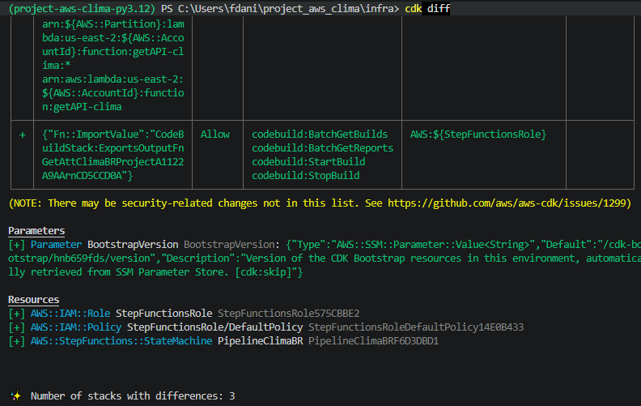

# Infraestrutura AWS CDK - Projeto ClimaBR

Este diretório contém a definição da infraestrutura do projeto **ClimaBR** usando **AWS CDK com Python**.

> Observação: neste projeto, estamos usando **AWS CDK**, não apenas AWS SDK.  
> O SDK é usado para interagir com serviços AWS via código.  
> O CDK é usado para definir infraestrutura como código.

## O que é AWS CDK?

AWS CDK significa **Cloud Development Kit**.

Ele permite criar infraestrutura AWS usando linguagens de programação, como Python, TypeScript, Java ou JavaScript.

Neste projeto, usamos Python para descrever recursos como:

- AWS Glue Crawler
- AWS CodeBuild
- AWS Step Functions
- IAM Roles
- IAM Policies
- Integrações entre serviços AWS

O CDK transforma esse código Python em templates AWS CloudFormation.

## O que é CloudFormation?

AWS CloudFormation é o serviço da AWS que cria, altera e gerencia infraestrutura a partir de templates.

O CDK não cria os recursos diretamente. Ele gera templates CloudFormation, e o CloudFormation é quem aplica esses templates na AWS quando um deploy é executado.

## Para que serve o CDK?

O CDK serve para transformar infraestrutura em código versionável.

Em vez de configurar tudo manualmente pelo Console AWS, é possível declarar os recursos em arquivos Python e manter essa configuração no Git.

Com isso, o projeto ganha:

- rastreabilidade das mudanças
- rastreabilidade das mudanças
- documentação técnica viva
- padronização da infraestrutura
- facilidade para revisar alterações
- base para automação futura
- preparação para releases controladas

### Pré-requisitos:

Para usar o AWS CDK neste projeto, é necessário ter instalado:

- Node.js ( Global )
- npm
- AWS CDK CLI ( Global )
- Python
- Ambiente virtual Python do projeto
- Dependências Python do CDK
- AWS CLI configurado com credenciais válidas ( Global )
*O AWS CDK CLI é distribuído via npm. Por isso, o Node.js precisa estar instalado.*

## Estrutura do diretório infra?
```
infra/
├── app.py
├── cdk.json
├── stacks/
│   ├── glue_crawler_stack.py
│   ├── codebuild_stack.py
│   └── step_functions_stack.py
└── scripts/
    └── reports/
```

### Arquivo app.py

O app.py é o ponto de entrada da aplicação CDK.
Ele instancia as stacks do projeto:

- GlueCrawlerStack
- CodeBuildStack
- StepFunctionsStack

>Também define a região AWS usada pelo projeto e centraliza configurações auxiliares.

## Stacks do projeto
### GlueCrawlerStack

> Define a infraestrutura relacionada ao AWS Glue Crawler.

Recursos descritos:
- IAM Role para o Glue
- Policy de leitura no bucket S3
- Glue Crawler para catalogar os dados da camada raw

*O objetivo do crawler é catalogar os arquivos climáticos armazenados no S3, permitindo consultas futuras via Glue Data Catalog, Athena e ferramentas analíticas.*

### CodeBuildStack

*Define a infraestrutura relacionada ao AWS CodeBuild.*

Recursos descritos:
- IAM Role para o CodeBuild
- permissões para S3
- permissões para Athena
- permissões para Glue Data Catalog
- permissões para CloudWatch Logs
- projeto CodeBuild do pipeline ClimaBR

**O CodeBuild executa rotinas automatizadas configuradas no buildspec.yml.**

### StepFunctionsStack:

> Define a orquestração do pipeline usando AWS Step Functions.

Fluxo esperado:
- Invocar a Lambda de ingestão climática
- Iniciar o Glue Crawler
- Consultar o estado do crawler
- Aguardar enquanto o crawler estiver em execução
- Iniciar o CodeBuild após a finalização do crawler

*A Step Function conecta os serviços do pipeline e organiza a execução em etapas controladas.*

A infraestrutura principal do projeto ClimaBR já foi criada manualmente pelo Console AWS.
Por isso, neste momento, o CDK não será usado para criar os recursos na AWS.
Como os recursos já existem na AWS, um cdk deploy poderia tentar criar recursos com nomes que já estão em uso.


## Situação atual do projeto

A infraestrutura principal do projeto ClimaBR já foi criada manualmente pelo **Console AWS**.

Atualmente, o CDK está sendo usado como uma camada de documentação, validação e preparação para evolução futura da infraestrutura.

Neste momento, a decisão é seguir com a seguinte abordagem:

## Opção A - Sem deploy via CDK 

Os recursos existentes continuam sendo gerenciados pelo Console AWS.

O CDK será usado para:

- documentar a infraestrutura existente
- validar a modelagem dos recursos
- gerar templates CloudFormation localmente
- comparar diferenças com a AWS usando `cdk diff`
- preparar o projeto para uma futura release

Neste momento, **não será executado `cdk deploy`**.

Isso é importante porque os recursos já existem na AWS. Se o CDK tentar criar recursos com os mesmos nomes, o deploy pode falhar com erros como:

```text
AlreadyExistsException
Resource already exists
```

### Comandos principais do CDK

```cdk synth```

Esse comando gera templates CloudFormation a partir do código CDK.
Ele não altera nada na AWS.

```Successfully synthesized to C:\Users\fdani\project_aws_clima\infra\cdk.out```

```cdk diff```

Esse comando compara o que está definido no CDK com o que existe na AWS.
Ele ajuda a entender o que seria criado, alterado ou removido se fosse feito um deploy.

Resultado obtido:



---

```cdk deploy```

Esse comando aplica as mudanças na AWS.
No momento, este comando não deve ser executado.

### Caminhos futuros:

No futuro, caso o projeto passe a ser gerenciado totalmente por CDK, existem duas opções:
- Opção 1 - Recriar recursos pelo CDK
    - Remover os recursos criados manualmente no Console AWS e recriá-los com:
            
            ```cdk deploy --all```
*Essa opção é mais simples, mas exige cuidado porque pode impactar recursos existentes.*

- Opção 2 - Importar recursos existentes
    - Importar os recursos criados manualmente para stacks CloudFormation/CDK.
*Essa opção preserva os recursos existentes, mas exige mais cuidado técnico.*

### Decisão atual:

A decisão atual é manter os recursos existentes no Console AWS, usar o CDK como documentação e validação, versionar a infraestrutura como código, preparar o projeto para uma futura release
e não executar cdk deploy neste momento.

### Comandos seguros neste estágio:

- cdk synth
- cdk diff

**Comando não recomendado neste estágio**
- cdk deploy

